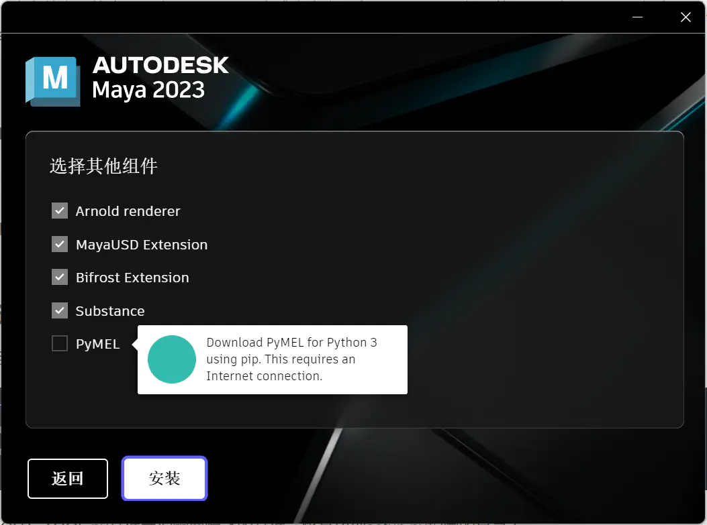
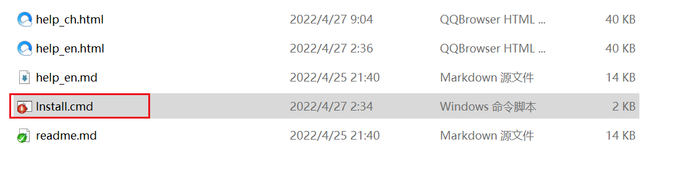
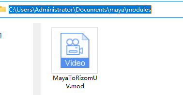
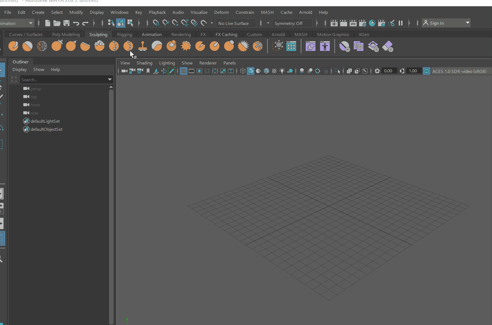
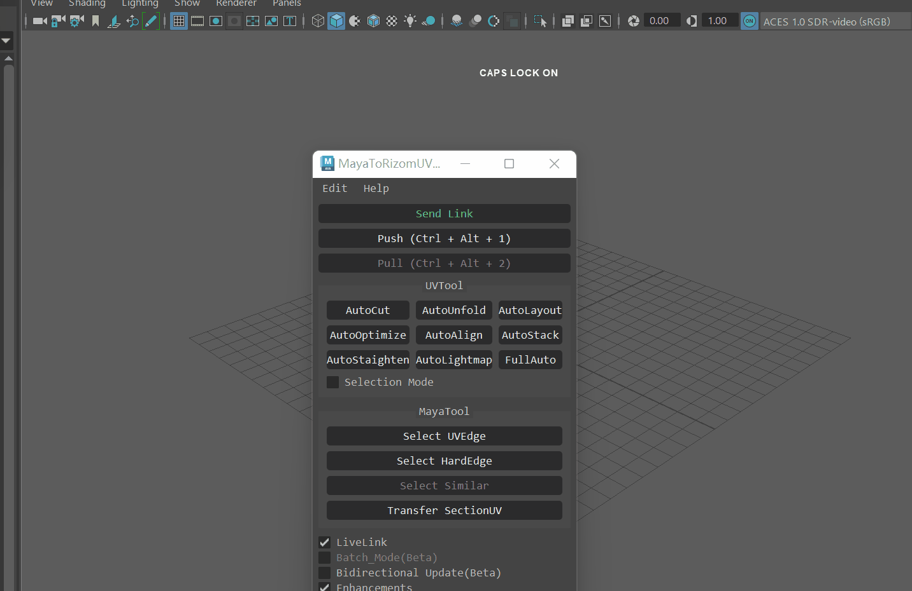
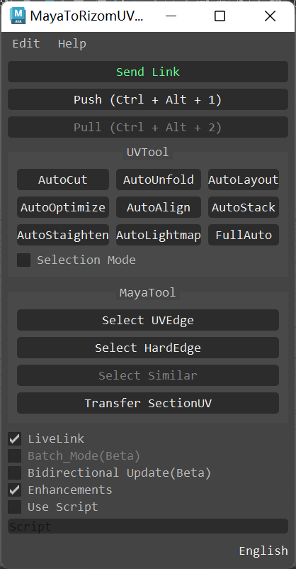

   

# What is MayaToRizomUV? -  MayaToRizomUV是什么? 
这是一个能实时在RizomUV与Maya间分UV的工具。

 

This is a tool that can split UVs between RizomUVs and Maya in real time.

 

---
## Features - 特性
* 方便的`交互式分UV`功能
* 独特的`双向传递UV`功能
* 工具省去相互导入导出的操作，`快捷高效`
* 编辑和预览`同步`，所见即所得
* 模型只需保存即可自动化传递UV，`制作效率高错误几率小`
* 强大的`自动化分UV`功能，快速实现效果
* 实时操作修改模型UV，`交互效率高`
* 完美兼容**Maya2017.5-Maya2023**多版本
* 具有多项传递、选择边线等功能，`功能丰富强大`
* 快捷的`一键式`安装的插件
  
 

* Convenient `interactive UV split` function
* Unique 'bidirectional UV transmission' function
* The tool saves the operation of importing and exporting each other, `fast and efficient`
* Edit and preview `sync`, WYSIWYG
* The model can automatically transfer UVs just by saving, `high production efficiency and small error probability`
* Powerful `Automated UV` function to quickly achieve the effect
* Real-time operation to modify model UV, `high interaction efficiency`
* Perfectly compatible with **Maya2017.5-Maya2023** versions
* With multiple functions such as transfer and edge selection, `rich and powerful`
* Quick `one-click` installation of plugins

 

---

## Installation - 安装

#### Maya2022及Maya2023使用时需要在Maya安装时安装PyMel3
或者使用安装目录下的**Install_PyMel.cmd**安装
* When using Maya2022 and Maya2023, you need to install PyMel3 when installing Maya
Or use **Install_PyMel.cmd** in the installation directory to install

 

### Automatic installation - 自动安装

0. 使用前需要检查电脑是否有管理员权限
1. 点击MayaToRizomUV文件夹中的**install.cmd**进行安装
2. 出现Install Successful表示安装成功

 

0. Before use, you need to check whether the computer has administrator privileges
1. Click **install.cmd** in the MayaToRizomUV folder to install
2. If Install Successful appears, the installation is successful.

 

### Manual installation - 手动安装
1. 点击MayaToRizomUV文件夹中的**install.cmd**进行安装
2. 在MayaToRizomUV文件夹中找到modules文件夹，复制到我的文档中Maya文件夹下

 

1. Click **install.cmd** in the MayaToRizomUV folder to install
2. Find the modules folder in the MayaToRizomUV folder and copy it to the Maya folder in My Documents

 

---

## Usage - 用法
###### Specifically search for mayatorizomuv in YouTube - 具体在B站搜索mayatorizomuv
### First use - 第一次使用

1. 重开Maya后找到在Windows-Setting/Perferences中的Plug-in Manager，搜索MayaToRizomuv.py插件点击Loaded进行使用
2. 找到窗口上方布局的工具按钮并点击

 

1. After reopening Maya, find the Plug-in Manager in Windows-Settings/Perferences, search for the MayaToRizomuv.py plugin and click Loaded to use it
2. Find the tool button in the layout above the window and click

- 自动查找Rizomuv路径，可不设置路径
1. * 可以直接点击Send Link
   * 如果想快速的话可以直接点Push或者自动化功能，会弹出是否启动程序，选是即可
2. 点击后启动程序即可分UV
3. 在需要传回maya时点击Pull即可(或者在Rizomuv中使用Ctrl+S保存)

- 手动设置Rizomuv路径
1. 点击Edit-Preferences
2. 点击...打开RizomUV.exe启动文件选择
3. 设置完毕后点击Ok

 

- Atomatically finds the Rizomuv path, you can not set the path
1. * You can click Send Link directly
   * If you want to be quick, you can directly click the Push or automation function, and it will pop up whether to start the program, select yes
2. Click and start the program to divide UV
3. Click Pull when you need to send back to maya(Or use Ctrl + s to save in rizomuv)

- Set Rizomuv path
1. Click 击Edit-Preferences
2. Click ... to open RizomUV.exe startup file selection
3. Click Ok after setting

 

---

 
### Send Link / Stop Linking - 发送连接请求 / 中断链接
* 发送连接请求开启Maya和Rizomuv的连接，可以在软件中修改UV，中断链接则会关闭Rizomuv
* Send a connection request to open the connection between Maya and rizomuv, you can modify the UVs in the software, and breaking the link will close rizomuv

 

### Push - 上传UV
###### 快捷键： Ctrl + Alt + 1
###### Shortcut: Ctrl + Alt + 1
* 上传选择的模型至Rizomuv
* Upload the selected model to rizomuv

 

### Pull - 下载UV
###### 快捷键： Ctrl + Alt + 2
###### Shortcut: Ctrl + Alt + 1
* 下载RizomUV的UV到场景模型
* Download the UVs of rizomuv to the scene model

 

### UVTool - UV自动化工具
##### AutoCut - 自动切线 
* 自动切割模型UVShell，如果在选择模式的模式下则是在选择的Shell中切割
* Automatically cut the model uvshell. If it is in the selected mode, it is cut in the selected shell
 
  
##### AutoUnfold - 自动展开
* 自动展开模型UVShell，如果在选择模式的模式下则是在选择的Shell中展开
* Automatically unfold the model uvshell. If it is in the selected mode, it is unfold in the selected shell
 

##### AutoLayout - 自动布局
* 自动布局模型UVShell，如果在选择模式的模式下则是在选择的Shell中自动布局
* Automatically layout the model uvshell. If it is in the selected mode, it is automatically layout in the selected shell
 

##### AutoOptimize - 自动优化
* 自动优化模型UVShell，如果在选择模式的模式下则是在选择的Shell中自动优化
* Automatically optimize the model uvshell. If it is in the selected mode, it is automatically optimized in the selected shell
 

##### AutoAlign - 自动排列
* 自动排列模型UVShell，如果在选择模式的模式下则是在选择的Shell中自动排列
* Automatically align the model uvshell. If it is in the selected mode, it is automatically aligned in the selected shell
 

##### AutoStack - 自动堆叠
* 自动堆叠模型UVShell，如果在选择模式的模式下则是在选择的Shell中自动堆叠
* Automatically stack the model uvshell. If it is in the selected mode, it is automatically stacked in the selected shell
 

##### AutoStaighten - 自动打直
* 自动打直模型UVShell，如果在选择模式的模式下则是在选择的Shell中自动打直
* Automatically staighten the model uvshell. If it is in the selected mode, it is automatically staighten in the selected shell
 

##### AutoLightmap - 自动生成光照UV
* 自动生成模型光照UV，如果在选择模式的模式下则是在选择的Shell自动生成光照UV
* Automatically generate model lighting UVs. If in the mode of selection mode, the lighting UVs are automatically generated in the selected shell
 

##### FullAuto - 全自动化
###### 快捷键： Ctrl + Alt + 3
###### Shortcut: Ctrl + Alt + 1
* 全自动化处理模型UVShell，如果在选择模式的模式下则是在选择的Shell中全自动化处理
* The fully automated processing model uvshell is fully automated in the selected shell if it is in the selected mode
 

---

### MayaTool - Maya工具
##### Select UVEdge - 选择UV边缘线
* 选择UV边缘线
* select UV edge

 
##### Select HardEdge - 选择硬边
* 选择硬边
* Select hard edge

 
##### Select Similar - 选择相似模型
* 选择相同的物体
* select the same object

 
##### Transfer SectionUV - 传递选择的UV
* 对选择的物体进行UV传递，仅作用于相同拓扑
* Perform UV transfer on selected objects, only for the same topology

 
##### LiveLink - 实时链接模式
* 开启即可使用实时修改UV
* Turn on to modify UVs in real time

 
##### Bidirectional Update(Beta) - 双向传递(测试版)
* 开启即在RizomUV中自动将UV信息传递回Maya
* When on, UV information is automatically transferred back to Maya in rizomuv

 
##### Scrpit - 脚本
* 可以使用自定义脚本进行自动化处理 \
如fullAuto("pSphere*") \
参照maya的cmd的语法使用
* Can be automated using custom scripts \
Such as fullAuto("pSphere*") \
Refer to the syntax of maya's cmd to use

 

#### Tools can access independent window script examples - 工具可接入独立窗口脚本示例
##### Maya2017.5 - 2020
from mtor27 import mainwindow as mtor
mtor.open_tool_window()
##### Maya2022
from mtor37 import mainwindow as mtor
mtor.open_tool_window()
##### Maya2023
from mtor37 import mainwindow as mtor
mtor.open_tool_window()

 

---

## Updatelog - 更新日志
##### V2.2.2 最新
* 增加未安装Pymel会报错提示
* 添加自动安装Pymel脚本

##### V2.2.2 Latest
* Adding an error prompt if pymel is not installed
* Add auto install pymel script
  
 

##### V2.2.1
* 修复未安装Rizomuv会报错的BUG
* 添加独立窗口接口函数
* 本地化提示文本

##### V2.2.1
* Fix the bug that will report an error if rizomuv is not installed
* Add independent window interface function
* Localized prompt text

 

##### V2.2.0
* 双向传递支持所有操作识别传递
* 上传UV和下载UV以及全自动化支持快捷键，可以更快的操作
* 修复部分因我的文档地址不在C盘导致的软件安装失败
* 本地化用户帮助

##### V2.2.0
* Support change operation all recognition
* Upload UV and Download UV and fully automated support, operations that can be used
* Repair part of the software installation failure caused by the fact that my document address is not in the C drive
* Localized user help

 

##### V2022.4.25.04
* 修复按键无法正确Link的问题
* 支持Maya分UV，并自动更新到Rizomuv
* 添加双向传递的功能，支持部分自动传递(Rizomuv性能会受影响)
* 修复无法正确选择物体的Bug
* 修复OS Native模式下无法传递UV的Bug
* 优化传递UV运行逻辑

 

##### V2022.4.25.04
* Fix the problem that the key does not link correctly
* Support Maya to divide UVs and automatically update to rizomuv
* Add the function of two-way delivery and support partial automatic delivery (rizomuv performance will be affected)
* Fix bug that cannot select object correctly
* Fix bug that cannot transfer UVs in OS native mode
* Optimize transfer UV operation logic

##### V2022.4.23.16
* 更方便快捷的安装，无需新建modules文件夹（C盘有权限操作的情况下）
* 自动识别Rizomuv安装路径，无特殊情况不用设置。
* 稳定的LiveLink实时与Rizomuv交互，默认开启。
* 修复重名无法下载的BUG
* 修复有几率软件死循环或者崩溃的BUG
* 优化代码逻辑，运行速度更快且不会卡顿
* 更新后支持Maya2023，但仅支持Maya2017-Maya2023的版本，不支持其他版本
* 需要注意模型有历史时需要清除模型历史，否则有可能无法下载UV
* 本地化手册（英语和中文不同）

 

##### V2022.4.23.16
* More convenient installation, add a shortcut to the module folder (if the C drive has permission)
* Automatic identification of Rizomuv installation path, no need to set unless there are special circumstances.
* Stable real-time link with Rizom Live, enabled by default.
* Fix the bug that the same name cannot be downloaded
* Fix software bugs where the software has an infinite loop or crashes
* Optimize the code frame logic, run faster and not get stuck
* Maya2023 is supported after the update, but only Maya2017-Maya2023 versions are supported, other versions are not supported
* It should be noted that the model needs to be cleared when there is history, otherwise the UV may not be downloaded
* Localized manual (different in English and Chinese)

##### V2021.4.10.02
* 更新支持Maya2022,并且向下兼容至Maya2014
* 修改Web链接为GitHub及网盘
* 修复存在命名相同物体无法传递的BUG
* 修复使用中文无法通过功能按钮启动链接的BUG
* 优化安装方式，标准安装目录下第一次使用无需创建modules文件夹，实现一键式安装
* 优化实时链接LiveLink功能，提高稳定性
* 优化改进标准功能的传递功能
* 优化Node传递逻辑,交互速度提升30%
* 汉化Log提示内容

 

##### V2021.4.10.02
* Updated to support Maya2022, and backward compatible to Maya2014
* Modify the web link to GitHub and network disk
* Fixed a bug where objects with the same name could not be passed
* Fix the bug that the link cannot be started through the function button in Chinese
* Optimized the installation method, the first use in the standard installation directory does not need to create a modules folder to achieve one-click installation
* Optimize the LiveLink function of real-time link to improve stability
* Optimize and improve the transfer function of standard functions
* Optimized Node delivery logic, increasing interaction speed by 30%
* Sinicized Log prompt content

###### v2020.111201
* 添加内部下载地址，查看一般设置即可
* 修复中英文切换错误的问题

 

###### v2020.111201
* Add the internal download address and check the general settings
* Fixed the problem of switching between Chinese and English

###### v2020.110503
* 改进汉化，修复部分因中文无法运行的问题，以及添加安装成功提示
* 改进使用C重构插件，速度大幅度提升
* 添加增强功能按钮，默认开启，开启情况下无需在rizomuv手动保存，关闭则需要在rizomuv中进行手动保存，也会使其他高级功能无法使用，适用于增强功能在某些情况无法导出的情况
* 添加刷新按钮，如果发现无法拉取rizomuv中做好的uv可以在Preferences菜单中点击刷新。清除缓存按钮则是将做好的文件清除缓存数据

 

###### v2020.110503
* Improve localization, fix some problems that cannot be run due to Chinese, and add a successful installation prompt
* Improve the use of C refactoring plugin, the speed is greatly improved
* Add an enhanced function button, which is enabled by default. It is not necessary to manually save in rizomuv when it is turned on. If it is turned off, it needs to be manually saved in rizomuv, which will also make other advanced functions unavailable. It is suitable for enhanced functions that cannot be exported in some cases
* Add a refresh button, if you find that you can't pull the uv prepared in rizomuv, you can click refresh in the Preferences menu. The clear cache button is to clear the cached data of the prepared files

###### v2020.082702
* 更新未启动link的情况下使用命令的提示框，点击Yes即可自动打开link和后续功能
* 增加路径不正确的弹窗提示
* 增加其余8个自动化UV命令的自定义脚本，自动化脚本格式为###("cmd")，如fullAuto("pSphere*")表示对场景中所有带有pSphere的多边形进行自动化分UV
* 修复部分自动化脚本传输失败的问题

 

###### v2020.082702
* Update the prompt box for using the command without starting the link, click Yes to automatically open the link and subsequent functions
* Add pop-up prompt for incorrect path
* Added custom scripts for the remaining 8 automated UV commands. The automated script format is ###("cmd"), such as fullAuto("pSphere*"), which means to automatically divide UV for all polygons with pSphere in the scene
* Fixed the problem that some automated scripts failed to transfer

###### v2020.082201
* 更新界面，添加菜单栏功能，将程序选择放入首选项中
* 更新中文翻译
* 更新插件打开方式为菜单栏
* 添加Help和about的界面
* 添加调试使用license
* 添加自动化工具的选择和全局模式
* 修复AutoLink部分传递失效

 

###### v2020.082201
* Updated interface, added menu bar function, put program selection into preferences
* Updated Chinese translation
* Update the plugin to open the menu bar
* Add Help and about interface
* Add debugging license
* Add selection and global mode for automation tools
* Fix AutoLink partial delivery failure

 

---

 

## Contact - 联系
在使用中有任何问题，欢迎反馈给我，可以用以下联系方式跟我交流

* 邮件(32229170@qq.com)
* bilibili : https://space.bilibili.com/3415436?spm_id_from=333.1007.0.0
* 微信公众号(3DTech)
* QQ技术交流群: 76031183

---

If you have any questions in use, please give me feedback, you can communicate with me using the following contact information

* Email : 32229170@qq.com
* YouTube : https://www.youtube.com/channel/UCSwqj6r0rUDeGH42DmlwhrA
* WeChat public account : 3DTech
* QQ Group: 76031183

 

## Doc - 文档
* 最新更新 : https://www.jianshu.com/p/d82f2b21b05a
* 用户帮助 : https://www.jianshu.com/p/000663862bec
* 工具演示 : https://www.jianshu.com/p/bcbdc83c1a65
* GitHub : https://github.com/3DTech-Steven7/MayaToRizomuv

---

* Latest update : https://www.jianshu.com/p/d82f2b21b05a
* User Help : https://www.jianshu.com/p/000663862bec
* Tool demo: https://www.jianshu.com/p/bcbdc83c1a65
* GitHub: https://github.com/3DTech-Steven7/MayaToRizomuv

 

## Donor developer - 捐助开发者
在兴趣的驱动下,写一个`免费`的东西，有欣喜，也还有汗水，希望你喜欢我的工作，同时也能支持一下。

---

Driven by interest, writing a `free` thing, there is joy and sweat, I hope you like my work, and you can also support it.

 

## Authors and acknowledgment - 贡献者和感谢
感谢以下,排名不分先后
* 我東
* 余则成
* 刘超
* chenclean
* The dead is comin
* 香蕉橘子西瓜汁
* 北海公瑾
* 金王斌

---

Thanks for the following, in no particular order
* Wo Dong
* Yu Zecheng
* Liu Chao
* chenclean
* The dead is comin
* Banana Orange Watermelon Juice
* Beihai Gongjin
* Jin Wangbin

 

## License - 版权信息
该项目签署了GNU General Public License v3.0 授权许可，详情请参阅 LICENSE.md

---

The project is licensed under the GNU General Public License v3.0, see LICENSE.md for details

 

## About the author - 关于作者
Steven7
