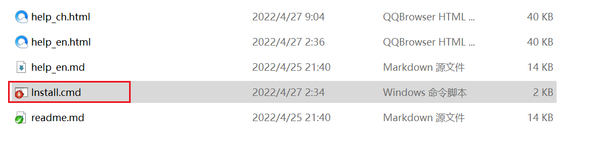
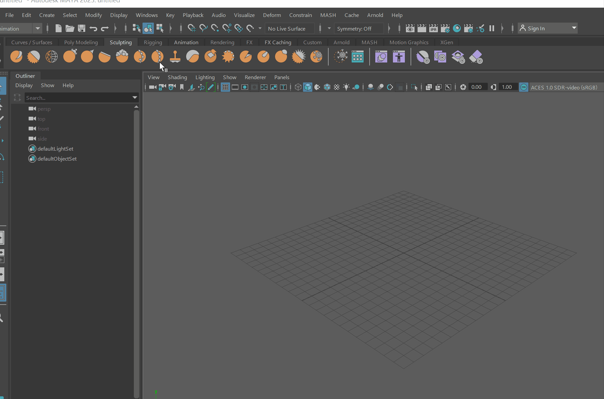
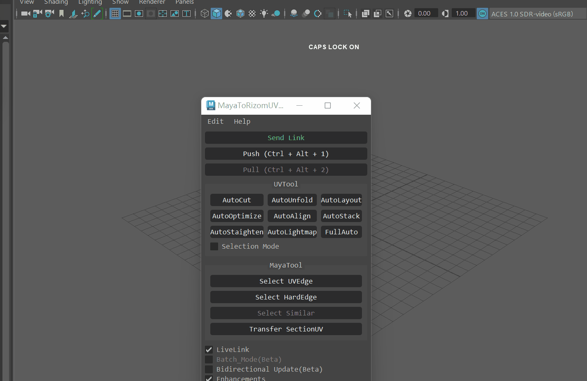
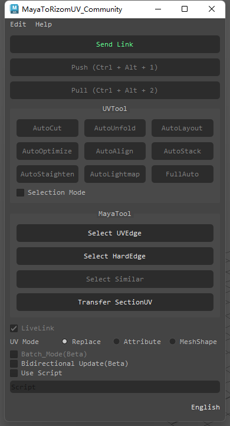
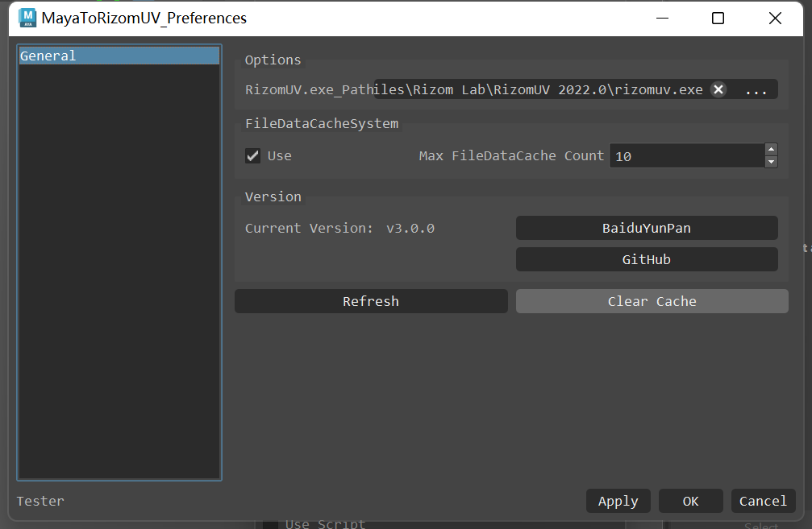

[TOC]

# MayaToRizomUV是什么?

这是一个能实时在RizomUV与Maya间分UV的工具。

 

可以完美解决Rizomuv导出FBX在maya后数据丢失的问题

 

---

## Features - 特性

* 方便的`交互式分UV`功能
* 独特的`双向传递UV`功能
* 使用C++开发的`文件数据缓存系统`
* 工具省去相互导入导出的操作，`快捷高效`
* 编辑和预览`同步`，所见即所得
* 模型只需保存即可自动化传递UV，`制作效率高错误几率小`
* 强大的`自动化分UV`功能，快速实现效果
* 实时操作修改模型UV，`交互效率高`
* 完美兼容**Maya2017.5-Maya2023**多版本
* 具有多项传递、选择边线等功能，`功能丰富强大`
* 快捷的`一键式`安装的插件

 

---

## 安装

#### Maya2022及Maya2023使用时需要在Maya安装时安装PyMel3

或者使用安装目录下的**Install_PyMel.cmd**安装

 

### 自动安装

0. 使用前需要检查电脑是否有管理员权限
1. 点击MayaToRizomUV文件夹中的**install.cmd**进行安装
2. 出现Install Successful表示安装成功

 

### 手动安装1

1. 点击MayaToRizomUV文件夹中的**install.cmd**进行安装
2. 在MayaToRizomUV文件夹中找到modules文件夹，复制到我的文档中Maya文件夹下

 

### 手动安装2

    + MayaToRizomUV 2.3.0 你的安装目录\MayaToRizomUV 

1. 在MayaToRizomUV文件夹中找到modules文件夹，新建一个txt文本，输入以上文字，需要替换安装目录路径
2. 文件名保存为MayaToRizomUV.mod
3. 复制到我的文档中Maya文件夹下

 

---

## 用法

###### 具体在B站搜索mayatorizomuv

### 第一次使用

1. 重开Maya后找到在Windows-Setting/Perferences中的Plug-in Manager，搜索MayaToRizomuv.py插件点击Loaded进行使用
2. 找到窗口上方布局的工具按钮并点击

* 自动查找Rizomuv路径，可不设置路径

1. * 可以直接点击Send Link
   * 如果想快速的话可以直接点Push或者自动化功能，会弹出是否启动程序，选是即可
2. 点击后启动程序即可分UV
3. 在需要传回maya时点击Pull即可(或者在Rizomuv中使用Ctrl+S保存)

* 手动设置Rizomuv路径

1. 点击Edit-Preferences
2. 点击...打开RizomUV.exe启动文件选择
3. 设置完毕后点击Ok

 

### 注意

    如果开启文件数据缓存系统，遇到Rizomuv闪退可以使用清除缓存。

 

---

 
### 发送连接请求 / 中断链接
* 发送连接请求开启Maya和Rizomuv的连接，可以在软件中修改UV，中断链接则会关闭Rizomuv

 

### 上传UV

###### 快捷键： Ctrl + Alt + 1

* 上传选择的模型至Rizomuv

 

### 下载UV

###### 快捷键： Ctrl + Alt + 2

* 下载RizomUV的UV到场景模型

 

### UV自动化工具

##### 自动切线

* 自动切割模型UVShell，如果在选择模式的模式下则是在选择的Shell中切割

 
  
##### 自动展开

* 自动展开模型UVShell，如果在选择模式的模式下则是在选择的Shell中展开

 

##### 自动布局

* 自动布局模型UVShell，如果在选择模式的模式下则是在选择的Shell中自动布局

 

##### 自动优化

* 自动优化模型UVShell，如果在选择模式的模式下则是在选择的Shell中自动优化

 

##### 自动排列

* 自动排列模型UVShell，如果在选择模式的模式下则是在选择的Shell中自动排列

 

##### 自动堆叠

* 自动堆叠模型UVShell，如果在选择模式的模式下则是在选择的Shell中自动堆叠

 

##### 自动打直

* 自动打直模型UVShell，如果在选择模式的模式下则是在选择的Shell中自动打直

 

##### 自动生成光照UV

* 自动生成模型光照UV，如果在选择模式的模式下则是在选择的Shell自动生成光照UV

 

##### 全自动化

###### 快捷键： Ctrl + Alt + 3

* 全自动化处理模型UVShell，如果在选择模式的模式下则是在选择的Shell中全自动化处理

 

---

### Maya工具

##### 选择UV边缘线

* 选择UV边缘线

 

##### 选择硬边

* 选择硬边

 

##### 选择相似模型

* 选择相同的物体

 

##### 传递选择的UV

* 对选择的物体进行UV传递，仅作用于相同拓扑

 

##### 实时链接模式

* 开启即可使用实时修改UV

 

##### 双向传递(测试版)

* 开启即在RizomUV中自动将UV信息传递回Maya

 

##### UV传递模式

###### 替换物体

* 开启则把原物体删除而使用修改UV后的新物体，默认使用这种方式

###### 属性传递

* 开启则使用属性传递UV，若物体面数过大可能导致Maya崩溃，运行效率较低，但能解决MeshShape传递变形和材质丢失，这种是Maya传递属性的方法

###### MeshShape

* 开启则使用MeshShape传递UV，不改变物体属性，通过修改MeshShape的方式传递，这种方法是本插件旧版本使用的方法

 

##### 脚本

* 可以使用自定义脚本进行自动化处理 \
如fullAuto("pSphere*") \
参照maya的cmd的语法使用

---

 

### 首选项

#### 选项

##### RizomUV程序路径

    自动识别路径，可用于修改其他的Rizomuv

#### 文件数据缓存系统

##### 开启

    开启会影响性能，但是会缓存Rizomuv信息

##### 最大缓存数量

    缓存越多查询时间越长

#### 刷新节点

    刷新Mtor引用节点和未使用的Rizomuv缓存内容

#### 清除缓存

    清除Rizomuv缓存内容

 

---

### 工具可接入独立窗口脚本示例

#### Maya2017.5 - 2020

    from mtor27 import mainwindow as mtor
    mtor.open_tool_window()

#### Maya2022

    from mtor37 import mainwindow as mtor
    mtor.open_tool_window()

#### Maya2023

    from mtor39 import mainwindow as mtor
    mtor.open_tool_window()

 

---

## 更新日志
##### V3.0.2 最新
* 修复配置文件无法保存的问题

 

##### V3.0.1
* 修复无法开启的bug

 

##### V3.0.0

* 新增文件缓存功能，防止程序意外退出导致的数据丢失
* 使用C++构建缓存功能，导出时附带记录Rizomuv信息，解决一般情况下FBX进入Maya后再导入RizomUV的信息丢失
* 修复使用IP地址路径无法开启插件的问题
* 修复修改Rizomuv路径后Config无法生效的问题
* 修复组内无法导入导出BUG
* 优化代码结构及导出结构，提升程序的稳定性和速度

 

##### V2.3.0

* 更新Uv传递的方式为替换物体、属性传递、MeshShape，详细说明可以看文档中的UV传递模式
* 推荐2.2.2以前版本升级此版本，而2.2.3 - 2.2.4版本必升此版本，否则可能经典传递传递导致崩溃，具体原因可以看文档中的UV传递模式

 

##### V2.2.4

* 修复中文路径无法传递BUG

 

##### V2.2.3

* 更新UV传递方式，默认开启经典修改UV则使用属性传递UV；关闭则使用MeshShape传递UV，可能会导致物体变形和材质丢失
* 增加自动开启插件Mel，安装插件后拖入Mel即可安装
* 因不支持低版本Maya而移除增强模式的选项，现默认为增加模式，原增强模式开关替换为经典修改UV
* 统一开启链接的接口，开启前不允许除开启链接按钮以外的方式开启，以增强稳定性

 

##### V2.2.2

* 增加未安装Pymel会报错提示
* 添加自动安装Pymel脚本

 

##### V2.2.1

* 修复未安装Rizomuv会报错的BUG
* 添加独立窗口接口函数
* 本地化提示文本

 

##### V2.2.0

* 双向传递支持所有操作识别传递
* 上传UV和下载UV以及全自动化支持快捷键，可以更快的操作
* 修复部分因我的文档地址不在C盘导致的软件安装失败
* 本地化用户帮助

 

##### V2022.4.25.04

* 修复按键无法正确Link的问题
* 支持Maya分UV，并自动更新到Rizomuv
* 添加双向传递的功能，支持部分自动传递(Rizomuv性能会受影响)
* 修复无法正确选择物体的Bug
* 修复OS Native模式下无法传递UV的Bug
* 优化传递UV运行逻辑

 

##### V2022.4.23.16

* 更方便快捷的安装，无需新建modules文件夹（C盘有权限操作的情况下）
* 自动识别Rizomuv安装路径，无特殊情况不用设置。
* 稳定的LiveLink实时与Rizomuv交互，默认开启。
* 修复重名无法下载的BUG
* 修复有几率软件死循环或者崩溃的BUG
* 优化代码逻辑，运行速度更快且不会卡顿
* 更新后支持Maya2023，但仅支持Maya2017-Maya2023的版本，不支持其他版本
* 需要注意模型有历史时需要清除模型历史，否则有可能无法下载UV
* 本地化手册（英语和中文不同）

 

##### V2021.4.10.02

* 更新支持Maya2022,并且向下兼容至Maya2014
* 修改Web链接为GitHub及网盘
* 修复存在命名相同物体无法传递的BUG
* 修复使用中文无法通过功能按钮启动链接的BUG
* 优化安装方式，标准安装目录下第一次使用无需创建modules文件夹，实现一键式安装
* 优化实时链接LiveLink功能，提高稳定性
* 优化改进标准功能的传递功能
* 优化Node传递逻辑,交互速度提升30%
* 汉化Log提示内容

 

###### v2020.111201

* 添加内部下载地址，查看一般设置即可
* 修复中英文切换错误的问题

 

###### v2020.110503

* 改进汉化，修复部分因中文无法运行的问题，以及添加安装成功提示
* 改进使用C重构插件，速度大幅度提升
* 添加增强功能按钮，默认开启，开启情况下无需在rizomuv手动保存，关闭则需要在rizomuv中进行手动保存，也会使其他高级功能无法使用，适用于增强功能在某些情况无法导出的情况
* 添加刷新按钮，如果发现无法拉取rizomuv中做好的uv可以在Preferences菜单中点击刷新。清除缓存按钮则是将做好的文件清除缓存数据

 

###### v2020.082702

* 更新未启动link的情况下使用命令的提示框，点击Yes即可自动打开link和后续功能
* 增加路径不正确的弹窗提示
* 增加其余8个自动化UV命令的自定义脚本，自动化脚本格式为###("cmd")，如fullAuto("pSphere*")表示对场景中所有带有pSphere的多边形进行自动化分UV
* 修复部分自动化脚本传输失败的问题

 

###### v2020.082201

* 更新界面，添加菜单栏功能，将程序选择放入首选项中
* 更新中文翻译
* 更新插件打开方式为菜单栏
* 添加Help和about的界面
* 添加调试使用license
* 添加自动化工具的选择和全局模式
* 修复AutoLink部分传递失效
