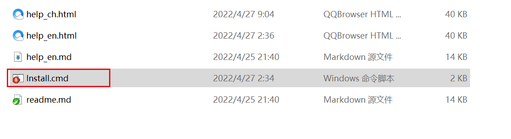

[TOC]

# What is MayaToRizomUV?

This is a tool that can split UVs between RizomUVs and Maya in real time.

 

It can perfectly solve the problem of data loss after Rizomuv exports FBX in Maya

 

---

## Features

* Convenient `interactive UV split` function
* Unique 'bidirectional UV transmission' function
* `File data cache system` developed with C++
* The tool saves the operation of importing and exporting each other, `fast and efficient`
* Edit and preview `sync`, WYSIWYG
* The model can automatically transfer UVs just by saving, `high production efficiency and small error probability`
* Powerful `Automated UV` function to quickly achieve the effect
* Real-time operation to modify model UV, `high interaction efficiency`
* Perfectly compatible with **Maya2017.5-Maya2023** versions
* With multiple functions such as transfer and edge selection, `rich and powerful`
* Quick `one-click` installation of plugins

 

---

## Installation

#### When using Maya2022 and Maya2023, you need to install PyMel3 when installing Maya

Or use **Install_PyMel.cmd** in the installation directory to install

 

### Automatic installation

0. Before use, you need to check whether the computer has administrator privileges
1. Click **install.cmd** in the MayaToRizomUV folder to install
2. If Install Successful appears, the installation is successful.

 

### Manual installation 1

1. Click **install.cmd** in the MayaToRizomUV folder to install
2. Find the modules folder in the MayaToRizomUV folder and copy it to the Maya folder in My Documents

 

### Manual installation 2

    + MayaToRizomUV 2.3.0 your installation directory\MayaToRizomUV 

1. Find the module folder in the ToRizomUV folder, create a new text, enter it, and replace the installation path
2. Save the file name as MayaToRizomUV.mod
3. Copy to the Maya folder in My Documents

 

---

## Usage

###### Specifically search for mayatorizomuv in YouTube

### First use

1. After reopening Maya, find the Plug-in Manager in Windows-Settings/Perferences, search for the MayaToRizomuv.py plugin and click Loaded to use it
2. Find the tool button in the layout above the window and click

* Atomatically finds the Rizomuv path, you can not set the path

1. * You can click Send Link directly
   * If you want to be quick, you can directly click the Push or automation function, and it will pop up whether to start the program, select yes
2. Click and start the program to divide UV
3. Click Pull when you need to send back to maya(Or use Ctrl + s to save in rizomuv)

* Set Rizomuv path

1. Click Edit-Preferences
2. Click ... to open RizomUV.exe startup file selection
3. Click Ok after setting

 

### Notice

    If you turn on the file data cache cache system, you can use to clear the cache when you encounter Rizomuv flash.

 

---

 
### Send Link / Stop Linking
* Send a connection request to open the connection between Maya and rizomuv, you can modify the UVs in the software, and breaking the link will close rizomuv

 

### Push

###### Shortcut: Ctrl + Alt + 1

* Upload the selected model to rizomuv

 

### Pull

###### Shortcut: Ctrl + Alt + 1

* Download the UVs of rizomuv to the scene model

 

### UVTool

##### AutoCut

* Automatically cut the model uvshell. If it is in the selected mode, it is cut in the selected shell

 
  
##### AutoUnfold

* Automatically unfold the model uvshell. If it is in the selected mode, it is unfold in the selected shell

 

##### AutoLayout

* Automatically layout the model uvshell. If it is in the selected mode, it is automatically layout in the selected shell

 

##### AutoOptimize

* Automatically optimize the model uvshell. If it is in the selected mode, it is automatically optimized in the selected shell

 

##### AutoAlign

* Automatically align the model uvshell. If it is in the selected mode, it is automatically aligned in the selected shell

 

##### AutoStack

* Automatically stack the model uvshell. If it is in the selected mode, it is automatically stacked in the selected shell

 

##### AutoStaighten

* Automatically staighten the model uvshell. If it is in the selected mode, it is automatically staighten in the selected shell

 

##### AutoLightmap

* Automatically generate model lighting UVs. If in the mode of selection mode, the lighting UVs are automatically generated in the
selected shell

 

##### FullAuto

###### Shortcut: Ctrl + Alt + 1

* The fully automated processing model uvshell is fully automated in the selected shell if it is in the selected mode

 

---

### MayaTool

##### Select UVEdge

* select UV edge

 

##### Select HardEdge

* Select hard edge

 

##### Select Similar

* select the same object

 

##### Transfer SectionUV

* Perform UV transfer on selected objects, only for the same topology

 

##### LiveLink

* Turn on to modify UVs in real time

 

##### Bidirectional Update(Beta)

* When on, UV information is automatically transferred back to Maya in rizomuv

 

##### UV Mode

###### Replace

* If enabled, the original lighting is eliminated and the new field of view after UV is used. This method is used by default.

###### Attribute

* If enabled, use attributes to transfer UVs. If the number of object faces is too large, Maya may crash and the operating efficiency is low, but it can solve the problem of MeshShape transfer deformation and material loss. This is Maya's method of transferring attributes.

###### MeshShape

* If enabled, use MeshShape to transfer UV, without changing object properties, by modifying MeshShape, this method is the method used by the old version of this plug-in

 

##### Scrpit

* Can be automated using custom scripts \
Such as fullAuto("pSphere*") \
Refer to the syntax of maya's cmd to use

---

 

### Preferences

#### Options

##### RizomUV.exe_Path

    Automatically identify paths, which can be used to modify other Rizomuvs

#### FileDataCacheSystem

##### Use

    Turning on will affect performance, but Rizomuv information will be cached

##### Max FileDataCache Count

    The more cache, the longer the query time

#### Refersh

    Refresh Mtor reference nodes and unused rizomuv cache contents

#### Clear Cache

    Clear rizomuv cache content

 

---

### Tools can access independent window script examples

#### Maya2017.5 - 2020

    from mtor27 import mainwindow as mtor
    mtor.open_tool_window()

#### Maya2022

    from mtor37 import mainwindow as mtor
    mtor.open_tool_window()

#### Maya2023

    from mtor39 import mainwindow as mtor
    mtor.open_tool_window()

 

---

## Updatelog
##### V3.0.2 Latest
* Fix the problem that the configuration file cannot be saved

 

##### V3.0.1
* Fix the bug that cannot be opened

 

##### V3.0.0

* Added file cache function to prevent data wills caused by accidental exit
* General function of manufacturing cache, use C to record information when exporting, record the information abandonment of RizomUV after FBX enters RizomUV and then enters RizomUV
* Fix the problem that the plugin cannot be opened using the IP address path
* Fix the problem that the configuration cannot take effect after modifying the Rizomuv path
* Fixed a bug that cannot be imported or exported within the group
* Optimize the code structure and export structure to improve the stability and speed of the program

 

##### V2.3.0

* The way to update the Uv transfer is to replace the object, attribute transfer, MeshShape. For details, see the UV transfer mode in the document
* It is recommended to upgrade this version from the previous version 2.2.2, and the version 2.2.3 - 2.2.4 must be upgraded to this version, otherwise the classic transfer transfer may cause a crash. For the specific reason, please refer to the UV transfer mode in the document.

 

##### V2.2.4

* Fix the bug that the Chinese path cannot be passed

 

##### V2.2.3

* Update the UV transfer method. By default, if Classic Modified UV is turned on, it will use attributes to transfer UV; if it is turned off, MeshShape will be used to transfer UV, which may cause object deformation and material loss.
* Add the automatic open plug-in Mel, after installing the plug-in, drag it into Mel to install
* The option to remove the enhanced mode because it does not support the lower version of Maya, now the default is the enhanced mode, and the original enhanced mode switch is replaced with the classic modified UV
* Unify the interface for opening the link. Before opening, it is not allowed to open the interface other than the open link button to enhance stability.

 

##### V2.2.2

* Adding an error prompt if pymel is not installed
* Add auto install pymel script

 

##### V2.2.1

* Fix the bug that will report an error if rizomuv is not installed
* Add independent window interface function
* Localized prompt text

 

##### V2.2.0

* Support change operation all recognition
* Upload UV and Download UV and fully automated support, operations that can be used
* Repair part of the software installation failure caused by the fact that my document address is not in the C drive
* Localized user help

 

##### V2022.4.25.04

* Fix the problem that the key does not link correctly
* Support Maya to divide UVs and automatically update to rizomuv
* Add the function of two-way delivery and support partial automatic delivery (rizomuv performance will be affected)
* Fix bug that cannot select object correctly
* Fix bug that cannot transfer UVs in OS native mode
* Optimize transfer UV operation logic

 

##### V2022.4.23.16

* More convenient installation, add a shortcut to the module folder (if the C drive has permission)
* Automatic identification of Rizomuv installation path, no need to set unless there are special circumstances.
* Stable real-time link with Rizom Live, enabled by default.
* Fix the bug that the same name cannot be downloaded
* Fix software bugs where the software has an infinite loop or crashes
* Optimize the code frame logic, run faster and not get stuck
* Maya2023 is supported after the update, but only Maya2017-Maya2023 versions are supported, other versions are not supported
* It should be noted that the model needs to be cleared when there is history, otherwise the UV may not be downloaded
* Localized manual (different in English and Chinese)

 

##### V2021.4.10.02

* Updated to support Maya2022, and backward compatible to Maya2014
* Modify the web link to GitHub and network disk
* Fixed a bug where objects with the same name could not be passed
* Fix the bug that the link cannot be started through the function button in Chinese
* Optimized the installation method, the first use in the standard installation directory does not need to create a modules folder to achieve one-click installation
* Optimize the LiveLink function of real-time link to improve stability
* Optimize and improve the transfer function of standard functions
* Optimized Node delivery logic, increasing interaction speed by 30%
* Sinicized Log prompt content

 

###### v2020.111201

* Add the internal download address and check the general settings
* Fixed the problem of switching between Chinese and English

 

###### v2020.110503

* Improve localization, fix some problems that cannot be run due to Chinese, and add a successful installation prompt
* Improve the use of C refactoring plugin, the speed is greatly improved
* Add an enhanced function button, which is enabled by default. It is not necessary to manually save in rizomuv when it is turned on. If it is turned off, it needs to be manually saved in rizomuv, which will also make other advanced functions unavailable. It is suitable for enhanced functions that cannot be exported in some cases
* Add a refresh button, if you find that you can't pull the uv prepared in rizomuv, you can click refresh in the Preferences menu. The clear cache button is to clear the cached data of the prepared files

 

###### v2020.082702

* Update the prompt box for using the command without starting the link, click Yes to automatically open the link and subsequent functions
* Add pop-up prompt for incorrect path
* Added custom scripts for the remaining 8 automated UV commands. The automated script format is ###("cmd"), such as fullAuto("pSphere*"), which means to automatically divide UV for all polygons with pSphere in the scene
* Fixed the problem that some automated scripts failed to transfer

 

###### v2020.082201

* Updated interface, added menu bar function, put program selection into preferences
* Updated Chinese translation
* Update the plugin to open the menu bar
* Add Help and about interface
* Add debugging license
* Add selection and global mode for automation tools
* Fix AutoLink partial delivery failure
